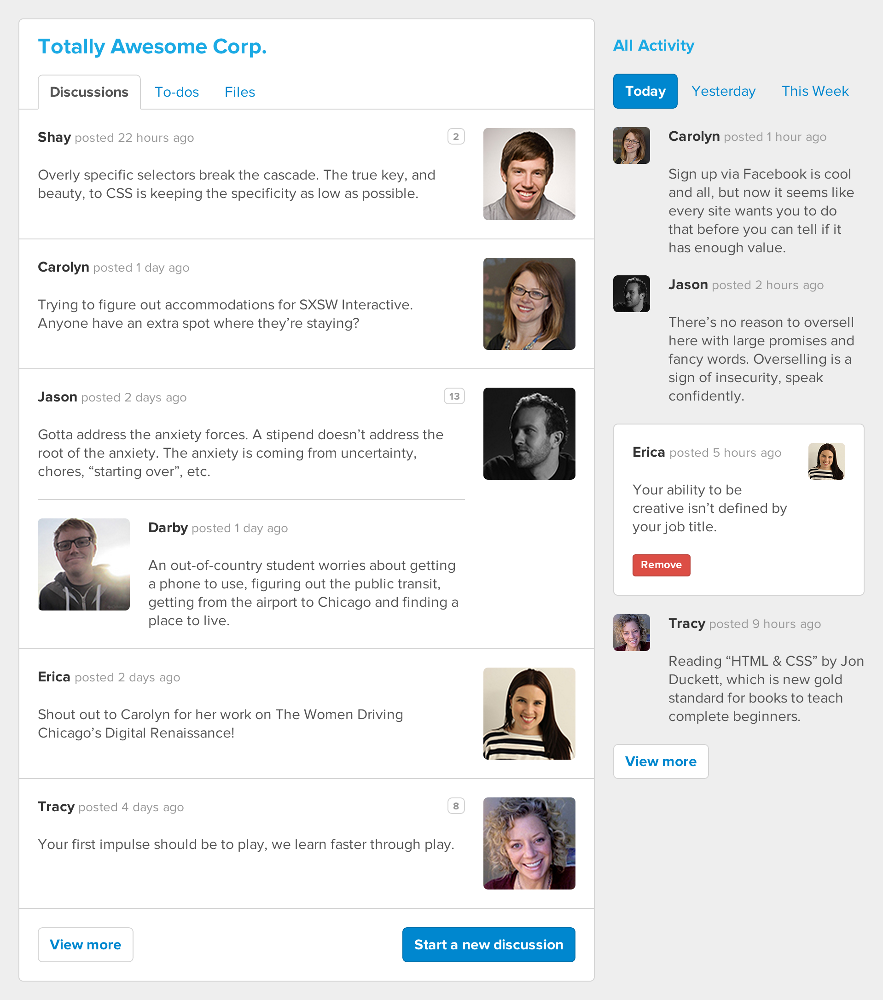

# Modular HTML, CSS, &amp; JS Workshop

* [Presentation Slides](https://speakerdeck.com/shayhowe/modular-html-css-and-js-workshop)
* [Workshop Files](https://github.com/shayhowe/modular-html-css-js-workshop/archive/master.zip)

You&#8217;ve been tasked with developing a new front end feature. HTML, CSS, and JavaScript are nothing new to you, in fact you even know a few tricks to get this feature out the door. It doesn&#8217;t take you long and the code works like a charm, yet you have a looming suspicion that some of the code might not be up to par. You&#8217;re likely right, and you&#8217;re definitely better than that.

We often write code without paying attention to the bigger picture, or overall code base. Upon stepping back we notice areas of duplicate code, ripe for refactoring. It&#8217;s time to build more modular front ends, focusing on the reusability of HTML, CSS, and JavaScript, and to take maintainability to heart.

## Assembling Layout

### Step 1

* Within the playlist, position the album artwork to the left of the song title and artist name
* Keep the album artwork vertically centered with the song title and artist name

**HTML**
```
<li class="playlist-song flag">
  <figure class="flag-object">
    
  </figure>
  <div class="flag-body">
    <h3 class="h-subheadline h-bold">Song Title</h3>
    <h4 class="artist h-byline">Artist Name</h4>
  </div>
</li>
```

**CSS**
```
/* Flag object
================================== */

.flag {
  display: table;
  width: 100%;
}
.flag-object,
.flag-body {
  display: table-cell;
  vertical-align: middle;
}
.flag-object img {
  display: block;
}
.flag-body {
  width: 100%;
}

/* Playlist
================================== */

.playlist-song .flag-object {
  padding: 0 20px;
}
.playlist-song .flag-object img {
  border-radius: 5px;
  height: 66px;
}
.playlist-song .flag-body {
  padding-right: 20px;
}
```

### Step 2

* Reusing styles from positioning the album artwork, add a `Currently loading…` section at the top of the file to displayed before the playlist loads

**HTML**
```
<div class="loading flag">
  <figure class="flag-object">
    
  </figure>
  <div class="flag-body">
    <h3>Currently loading&#8230;</h3>
  </div>
</div>
```

**CSS**
```
/* Loading
================================== */

.loading {
  color: #95959a;
  margin: 0 auto;
  padding: 66px;
  width: 292px;
}
.loading .flag-object {
  padding-right: 10px;
}
.loading .flag-object img {
  height: 22px;
}
```

## Accommodating Content

### Step 1

* Add `previous`, `play`, and `next` controls within the player
* Make the `previous` and `next` controls slightly smaller than the `play` control
* Keep all controls vertically centered

**HTML**
```
<header class="player cover-art controls-container">
  <menu class="controls">
    <li>
      <a class="control-prev ir" href="#">Previous</a>
    </li>
    <li>
      <a class="control-play ir" href="#">Play/Pause</a>
    </li>
    <li>
      <a class="control-next ir" href="#">Next</a>
    </li>
  </menu>
</header>
```

**CSS**
```
/* Controls
================================== */

.controls-container {
  position: relative;
}
.controls {
  background: linear-gradient(rgba(0, 0, 0, 0), rgba(0, 0, 0, .5));
  bottom: 0;
  margin: 0;
  padding: 44px 20px 22px 20px;
  position: absolute;
  text-align: center;
  width: 100%;
}
.controls li {
  display: inline-block;
  vertical-align: middle;
}
.controls a {
  background-image: url("../img/controls.png");
  background-image: url(“../img/controls.svg");
  border: 2px solid #fff;
  border-radius: 50%;
  display: block;
  height: 38px;
  margin: 0 8px;
  width: 38px;
}
.controls a:hover {
  background-color: rgba(0, 0, 0, .5);
}
.controls .control-play {
  height: 44px;
  width: 44px;
}
```

### Step 2

* Add `favorite` and `share` controls within each song in the playlist
* Reuse as many styles from the player controls as possible

**HTML**
```
<menu class="controls player-controls">
  ...
</menu>

...

<div class="flag-body controls-container">
  <h3 class="h-subheadline h-bold">Song Title</h3>
  <h4 class="artist h-byline">Artist Name</h4>
  <menu class="controls playlist-controls">
    <li>
      <a class="control-fav ir" href="#">Favorite</a>
    </li>
    <li>
      <a class="control-share ir" href="#">Share</a>
    </li>
  </menu>
</div>
```

**CSS**
```
/* Controls
======================================================= */

.controls-container {
  position: relative;
}
.controls {
  margin: 0;
  position: absolute;
  text-align: center;
}
.controls li {
  display: inline-block;
  vertical-align: middle;
}
.controls a {
  background-image: url("../img/controls.png");
  background-image: url("../img/controls.svg");
  border-radius: 50%;
  border-style: solid;
  border-width: 2px;
  display: block;
}

/* Player
======================================================= */

.player-controls {
  background: linear-gradient(rgba(0, 0, 0, 0), rgba(0, 0, 0, .5));
  bottom: 0;
  padding: 44px 20px 22px 20px;
  width: 100%;
}
.player-controls a {
  border-color: #fff;
  height: 38px;
  margin: 0 8px;
  width: 38px;
}
.player-controls a:hover {
  background-color: rgba(0, 0, 0, .5);
}
.player-controls .control-play {
  height: 44px;
  width: 44px;
}

/* Playlist
======================================================= */

.playlist-controls {
  background: linear-gradient(to right, rgba(255, 255, 255, 0), #fff 35px);
  height: 100%;
  padding: 0 20px 0 40px;
  right: 0;
  top: 0;
}
.playlist-controls li {
  position: relative;
  top: 50%;
  transform: translateY(-50%);
}
.playlist-controls a {
  border-color: #bfbfbf;
  height: 32px;
  width: 32px;
}
.playlist-controls a:hover {
  border-color: #7c7c87;
}
```

### Step 3

* Animate the player controls to appear from the bottom upon hovering over the player
* Animate the song controls to appear from the right upon hovering over a song
* Add hardware acceleration to each of the animations

**HTML**
```
<menu class="controls player-controls boost">
  ...
</menu>
<menu class="controls playlist-controls boost">
  ...
</menu>
```

**CSS**
```
/* Controls
================================== */

.controls-container {
  overflow: hidden;
  position: relative;
}
.controls {
  margin: 0;
  position: absolute;
  text-align: center;
  transition: all .2s ease-in-out;
}

/* Player
================================== */

.player-controls {
  background: linear-gradient(rgba(0, 0, 0, 0), rgba(0, 0, 0, .5));
  bottom: 0;
  padding: 44px 20px 22px 20px;
  transform: translateY(100%);
  width: 100%;
}
.player:hover .player-controls {
  transform: translateY(0);
}

/* Playlist (below now playing)
================================== */

.playlist-controls {
  background: linear-gradient(to right, rgba(255, 255, 255, 0), fff 35px);
  height: 100%;
  padding: 0 20px 0 40px;
  right: 0;
  top: 0;
  transform: translateX(100%);
}
.playlist-song:hover .playlist-controls {
  transform: translateX(0);
}
```

## Setting Up the JavaScript Application

### Step 1

* Our application will be using a few JavaScript libraries, let&#8217;s load these files on the page
* We can load [jQuery](http://jquery.com/) and [Handlebars](http://handlebarsjs.com/) from a CDN:

```
<script src="http://ajax.googleapis.com/ajax/libs/jquery/1.11.0/jquery.min.js"></script>
<script src="http://cdnjs.cloudflare.com/ajax/libs/handlebars.js/1.3.0/handlebars.min.js"></script>
```

* Add local files that allow us to interact with Rdio:

```
<script src="assets/js/vendor/jquery.rdio.js"></script>
<script src="assets/js/vendor/rdio-service.js"></script>
<script src="assets/js/player.js"></script>
<script src="assets/js/settings.js"></script>
```

* Load a JSON file with our playlist data (to prevent us from having to constantly hit Rdio during development):

```
<script src="data/playlist.json"></script>
```

* Add `data-player-loading` to the loading flag element
* Add `data-player-container` to the main player container element, and set the display property to `none` for the `.container` class

* Look at `PLAYLIST_DATA.data` and use the console to familiarize yourself with the data structure

### Step 2

* Create an object in `app.js` called `App` and load the script on the page:

```
<script src="assets/js/app.js"></script>
```

* Give the `App` object `RdioService`, `Templates`, `Player`, and `Playlist` properties, and assign all these properties a value of any empty object
* Give the object an `initialize` function &#8212; leave the function body empty for now

### Step 3

* Assign `App.RdioService` to a new instance of `RdioService`

### Step 4

* Inside the `initialize` function, create a new instance of the `Player` object and pass in a `playlistId` key with a value of `p8056088`
* Assign that new object to `App.Player`
* Call `initialize` on document ready so that the application boots when the page loads:

```
$(document).ready(function() {
  ...
});
```

* Take a look at `App.Player.playlistData` in the console, the data should look the same as `PLAYLIST_DATA.data`

## Building the Playlist Object

### Step 1

* Create a new object called `Playlist` in a file called `playlist.js` and load the script on the page:

```
<script src="assets/js/playlist.js"></script>
```

* Assign it to a constructor function that takes a parameter of `data`
* Set some instance variables in that function: `data`, `songs`, `currentSong`
  * Initalize `songs` with an empty arrays
  * Initalize `currentSong` with an empty object
  * Assign `data` to the value `data` parameter passed in to the constructor

### Step 2

* Create an `initialize` method on the prototype of the `Playlist` object &#8212; leave the function body empty for now
* Call the `initialize` method from the constructor function after the instance variables are assigned

### Step 3

* Back in the `player.js` file, find the `getPlaylistData` callback *(Hint: it&#8217;s where the `self.playlistData = data` assignment happens)*
* In that callback function, create a new `Playlist` object and assign it to `App.Playlist`
* Pass the callback `data` into the new `Playlist` object
* Take a look at `App.Playlist.data` in the console, the data should look the same as `PLAYLIST_DATA.data` and `App.Player.playlistData`

## Building the Song Object

### Step 1

* Create a new object called `Song` in a file called `song.js` and load the script on the page:

```
<script src="assets/js/song.js"></script>
```

* Assign it to a constructor function that takes a parameter of `data`
* Set some instance variables in that function:
  * `id` and assign it to `data.id`
  * `title` and assign it to `data.name`
  * `artist` and assign it to `data.artist`
  * `artwork` and assign it to `data.icon400`

### Step 2

* Test it out the new `Song` object with the following code:

```
data = {
  "id": "t8209409",
  "radioKey": "sr8209409",
  "baseIcon": "album/2/b/5/00000000000a85b2/1/square-200.jpg",
  "artistUrl": "/artist/Architecture_In_Helsinki/",
  "duration": 220,
  "album": "Contact High",
  "albumUrl": "/artist/Architecture_In_Helsinki/album/Contact_High/",
  "shortUrl": "http://rd.io/x/QHlRKz4bUw/",
  "albumArtist": "Architecture In Helsinki",
  "canStream": true,
  "embedUrl": "https://rd.io/e/QHlRKz4bUw/",
  "trackNum": 1,
  "albumArtistKey": "r86460",
  "icon": "http://rdio1img-a.akamaihd.net/album/2/b/5/00000000000a85b2/1/square-200.jpg",
  "name": "Contact High",
  "artistKey": "r86460",
  "url": "/artist/Architecture_In_Helsinki/album/Contact_High/track/Contact_High/",
  "icon400": "http://rdio3img-a.akamaihd.net/album/2/b/5/00000000000a85b2/1/square-400.jpg",
  "artist": "Architecture In Helsinki",
  "albumKey": "a689586"
}

mySong = new Song(data)
```

## Rendering the Song

### Step 1

* Add data attributes to the markup in the places where the song information should be rendered, we&#8217;ll use: `data-song-title`, `data-song-artist`, `data-song-artwork`
* Be sure to get both places for the artwork attribute

### Step 2

* Create an `render` method on the prototype of the `Song` object
* Use jQuery to render the song title, artist and artwork to the browser using the data attributes as your selectors
* Try rendering you song object from the previous section: `mySong.render()`

## Rendering the Playlist

### Step 1

* In the `initialize` method `Playlist` object use a `forEach` loop to create new `Song` objects from each song entry in the `data` object
* Push those objects into the `songs` array in the `Playlist` object
* Take a look at `App.Playlist.songs` in the console, you should see a bunch of `Song` objects
* See if you can render one of them. *(Hint: `App.Playlist.songs[2].render()`)*

### Step 2

* Now we need to create a Handlebars template so that we can render each song to the player&#8217;s playlist
* Add a script tag with the type of `text/x-handlebars-template` and add the `data-template-song` data attribute (This will be the container for the Handlebars template)
* Copy one of the `li`s from the existing markup and paste it inside the Handlebars container
* Add Handlebars variables for each of dynamic pieces of the template (`title`, `artist` and `artwork`) (Variables in Handlebars are defined by double curly braces, i.e. `{{myVariable}}`)

### Step 3

* Add the template to the `App.Templates` object and give it the name `playlistSong`
* Use the Handlebars.compile function like so: `Handlebars.compile($('[data-template-song]').html())`
* Test the template rendering with the following code:

```
data = {
  title: "Contact High",
  artist: "Architecture In Helsinki",
  artwork: "http://rdio3img-a.akamaihd.net/album/2/b/5/00000000000a85b2/1/square-400.jpg"
}

App.Templates.playlistSong(data)
```

### Step 4

* Add a data attribute of `data-playlist` to the `ul` tag that wraps all of the list items in the playlist
* Remove all the static `li` elements from the playlist, leaving just the wrapping `ul` tag
* Create a `render` method in the `Playlist` prototype to render the playlist
* We only want to display the next 5 songs on the playlist, so use the `slice` function to get the first 5 songs from the `songs` array
* Now, use a `forEach` loop the render each object in your new array and append it to the `data-playlist` `ul` node
* Try out your new render method by calling `App.Playlist.render()` in the console

### Step 5

* At the beginning of the render method, assign the first song in the `songs` array to `currentSong` so that we can render that song to the player
* Since the first song is now our `currentSong`, let move that element to the bottom of the array using the following code:

```
this.songs = this.songs.concat(this.songs.splice(0, 1));
```

* Call `render` on `currentSong` at the end of the `Playlist` render function
* In the `Playlist` `initialize` function, add a call to `render` so that the playlist will be rendered when then object is created

## Final Product


