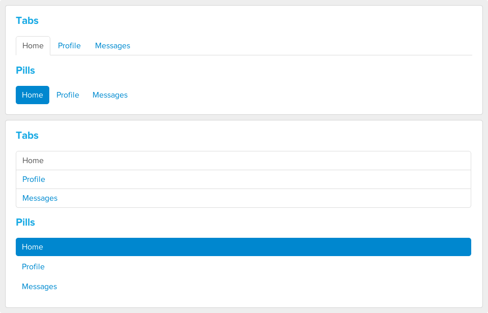

# Modular HTML &amp; CSS Workshop

* [Presentation Slides](https://speakerdeck.com/shayhowe/modular-html-and-css-workshop)
* [Workshop Files](https://github.com/shayhowe/modular-html-css-workshop/archive/master.zip)

## #1 - Media Object

Using [01-media-object.html](https://github.com/shayhowe/front-end-legos-workshop/blob/master/01-media-object/01-media-object.html) and [01-media-object.css](https://github.com/shayhowe/front-end-legos-workshop/blob/master/01-media-object/01-media-object.css), complete the following:

**Step 1:**

* Place a feed in to primary and secondary columns
* Float images to the left and content to right
* Visually offset the primary feed
* Visually offset one unique item inside the secondary column

**Step 2:**

* Add borders around each primary item
* Add counts to a few primary items

**Step 3:**

* Reverse the position of images and content within the primary column, placing the images on the right and content on the left
* Leave any nested items within the primary column inversed, with images on the left and content on the right
* Reverse the position of images and content within any offset items in the secondary column, placing the images on the left and content on the right

**Result:**

## #2 - Buttons

Using [02-buttons.html](https://github.com/shayhowe/front-end-legos-workshop/blob/master/02-buttons/02-buttons.html) and [02-buttons.css](https://github.com/shayhowe/front-end-legos-workshop/blob/master/02-buttons/02-buttons.css), complete the following:

**Step 1:**

* Create 5 different button styles, including:
 * `Default`, `Success`, `Warning`, `Danger`, `Boring`

**Step 2:**

* Create 4 different buttons sizes, including:
  * `Large`, `Small`, `Mini`

**Step 3:**

* Ensure the button styles that can be applied to any element, specifically including:
  * `a`, `button`, `input`, `span`, `div`

**Result:**

## #3 - Navigation

Using [03-navigation.html](https://github.com/shayhowe/front-end-legos-workshop/blob/master/03-navigation/03-navigation.html) and [03-navigation.css](https://github.com/shayhowe/front-end-legos-workshop/blob/master/03-navigation/03-navigation.css), complete the following:

**Step 1:**

* Create a horizontal tab style navigation using an unordered list

**Step 2:**

* Create a horizontal pill style navigation using an unordered list

**Step 3:**

* Using the existing horizontal tab and pill navigations, create vertical tab and pill style navigation alternates

**Result:**

