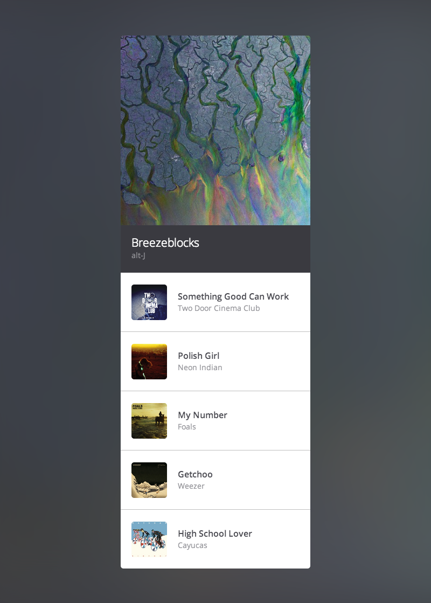

# Modular HTML &amp; CSS Workshop

* [Presentation Slides](https://speakerdeck.com/shayhowe/modular-html-and-css-workshop)
* [Turbo Presentation Slides](https://speakerdeck.com/shayhowe/modular-html-and-css-turbo-workshop)
* [Workshop Files](https://github.com/shayhowe/modular-html-css-workshop/archive/master.zip)

All too often writing HTML and CSS is an afterthought. Its the work that happens after design is finalized and the product has been developed. Its a necessary task in the process to building a website. Wrong.

HTML and CSS are the backbone to every website, and are equally as important as any design or development. At the end of the workshop and after spending time writing some of code attendees will be able to better organize their code, develop modular styles, and work with CSS specificity.

## Totally Awesome Corp.

### #1 - Media

**Step 1**

* Place two different feeds in to primary and secondary columns
* Float all profile images to the left and content to the right

**Step 2**

* Visually offset the primary column
* Visually offset one unique item inside the secondary column

**Step 3**

* Add borders around each item inside the primary column
* Reduce the width of the images within the secondary column

**Step 4**

* Add counts to a few items inside the primary column
* Change the "Posted&hellip;" text next to each name to be more subtle

**Step 5**

* Reverse the position of profile images and content within the primary column, placing the images on the right and content on the left
* Leave any nested items within the primary column inversed, with profile images on the left and content on the right
* Reverse the position of profile images and content within any offset items in the secondary column, placing the images on the left and content on the right

### #2 - Buttons

**Step 1**

* Add `View more`, `Start a new discussion`, and `Remove` buttons
  * Do not forget to account for different styles, sizes, and element types as outlined in the following steps

**Step 2**

* Compose 5 different button styles, including:
 * `Default`, `Success`, `Warning`, `Danger`, `Boring`

**Step 3**

* Compose 4 different buttons sizes, including:
  * `Default`, `Large`, `Small`, `Mini`

**Step 4**

* Ensure the button styles that can be applied to any element, specifically including:
  * `a`, `button`, `input`, `span`, `div`

### #3 - Navigation

**Step 1**

* Create a horizontal tab style navigation using an unordered list across the top of the primary column
  * Include links for `Discussions`, `To-dos`, and `Files`

**Step 2**

* Create a horizontal pill style navigation using an unordered list across the top of the secondary column
  * Include links for `Today`, `Yesterday`, and `This Week`

**Step 3**

* Create two new classes, `nav-tabs-stacked` and `nav-pills-stacked`, that transform the horizontal list tab and pill style navigations into stacked vertical lists

### Totally Awesome Corp. Final Product

## Boombox

### #1 Assembling Layout

**Step 1**

* Within the playlist, position the album artwork to the left of the song title and artist name
* Keep the album artwork vertically centered with the song title and artist name

**Step 2**

* Reusing styles from positioning the album artwork, add a `Currently loading…` section at the top of the file to displayed before the playlist loads

### #2 Accommodating Content

**Step 1**

* Add `previous`, `play`, and `next` controls within the player
* Make the `previous` and `next` controls slightly smaller than the `play` control
* Keep all controls vertically centered

**Step 2**

* Add `favorite` and `share` controls within each song in the playlist
* Reuse as many styles from the player controls as possible

**Step 3**

* Animate the player controls to appear from the bottom upon hovering over the player
* Animate the song controls to appear from the right upon hovering over a song
* Add hardware acceleration to each of the animations

### Boombox Final Product

# Turbo (Advanced)

Pure HTML and CSS allow us to be modular however CSS preprocessors greatly boost our capabilities, providing even more resources for better flexibility, organization, and performance. Using [SCSS](http://sass-lang.com/) let&#8217;s take another look at our example, refactoring it to be even more modular.

## Totally Awesome Corp.

### #1 - Setup

**Step 1**

* Inside the `assets` folder create a new folder named `scss`
  * Move the `workshop.css` file into this new folder
* Download and install the [Scout App](http://mhs.github.io/scout-app/)
* Create a new project in Scout using the current set of files
  * Set `scss` as the input folder and `css` as the output folder
* Change the file extension of the `workshop.css` file to `workshop.css.scss`

### #2 - Organization

**Step 1**

* Inside the `scss` folder create folders for `base`, `components`, and `settings`
* Break apart `workshop.css.scss` appropriately into partials across these new folders
  * Partials must begin with an underscore, `_`, and have a file extension of `.scss`, not `.css.scss`
* Use the `workshop.css.scss` file to import Compass and all of the partials

### #3 - Settings

**Step 1**

* Create a `_variables.scss` file in the `settings` folder and add any appropriate variables
  * Include variables for  `Layout`, `Colors`, `Typography` and so forth

**Step 2**

* Develop any additional extends based of the necessary variables

### #4 - Refactor

**Step 1**

* Refactor the `base` partials using the appropriate variables and extends, including:
  * `_layout.scss` and `_typography.scss`
  * Add any additional variables, extends, or mixins as seen necessary

**Step 2**

* Refactor the `components` partials using the appropriate variables and extends, including:
  * `_buttons.scss`, `_lists.scss`, `_media.scss`, and `_nav.scss`
  * Add any additional variables, extends, or mixins as seen necessary

### #5 - Compile

**Step 1**

* Configure Scout App to compile the styles in a `Production` environment and `Compressed` output before any deploys